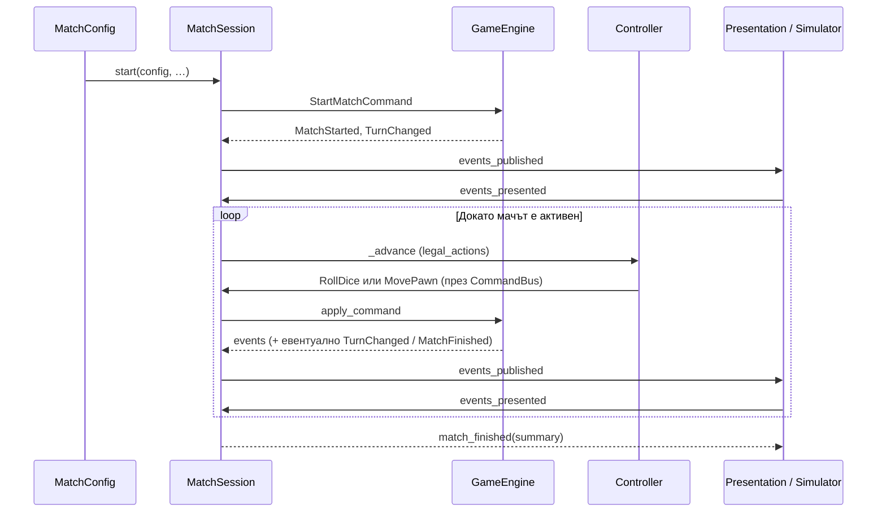

# Match Flow — как минава един мач

Кратък walkthrough на runtime пътя. Детайли за договори/слоеве:
`docs/V1_ARCHITECTURE.md` (§3, §4, §5). Application статус: `game/application/README.md`.

---

## 1. Кой какво прави (3 слоя)

| Клас | Слой | Роля с една дума |
|------|------|------------------|
| `MatchConfig` | Application | Входни данни за мача (seats, seed, animals…) |
| `MatchFactory` / `MatchSimulator` | Application | Създава session (+ AI controllers за headless) |
| `MatchSession` | Application | Оркестратор: притежава state/engine/RNG, gate към UI |
| `CommandBus` | Application | Единственият вход за команди към session |
| `PlayerController` (Human / AI / Remote) | Application | Избира *коя* команда, не прилага правила |
| `AIPolicy` | Application | Стратегия върху `legal_actions` |
| `EventQueue` | Application | FIFO буфер на domain events + sequence |
| `GameplayJournal` | Application | Append-only лог (команди + hashes) за replay |
| `GameEngine` | Domain | Валидира и прилага команда → нов state + events |
| `GameState` / `TurnState` | Domain | Source of truth (фаза, зар, пионки, ranking…) |
| `MoveRules` / `TurnRules` / … | Domain | Правила; engine ги вика, session не |
| Presentation (`GamePresenter`…) | Presentation | Анимира events; **не** мести логически пионки |

**Златно правило:** никой извън `GameEngine` не променя gameplay state.
Controller/UI само изпращат `GameCommand`; резултатът идва като `DomainEvent[]`.

---

## 2. Картина на един команден цикъл

```text
Controller (Human / AI)
		│  избира от legal_actions
		▼
  CommandBus.submit(cmd)
		│
		▼
  MatchSession.receive_command(cmd)
		│  stamp sequence; ако presentation pending → drop
		▼
  GameEngine.apply_command(state, cmd, rng)
		│
		├── reject → journal reject + command_rejected; state/RNG непроменени
		└── accept → нов GameState + DomainEvent[]
					│
					▼
			  journal: accepted + state_hash
			  EventQueue.enqueue
			  pending_sequence = N
			  events_published(N, events)
					│
					├── MatchFinished? → match_finished(summary); стоп
					└── иначе чака Presentation…
							  │
							  ▼
					events_presented(N)   ← UI / MatchSimulator auto
							  │
							  ▼
					MatchSession._advance()
							  │
							  ├── AI  → get_action → CommandBus.submit → цикълът отначало
							  └── Human → awaiting_human_action(legal_actions)
```

Headless (`MatchSimulator`): няма UI — след `events_published` веднага вика
`events_presented`, после пак AI ход, до `MATCH_FINISHED`.

---

## 3. Животен цикъл на мача



### Старт

1. Меню / тест / `MatchSimulator` строи `MatchConfig`.
2. `MatchSession.start(...)` създава `GameState`, `GameEngine`, RNG, `CommandBus`, journal.
3. Session **сама** подава `StartMatchCommand` → roster, първи ход (`AWAITING_ROLL`).

### Край

- Engine стига `TurnPhase.MATCH_FINISHED` (всички освен последния са класирани / finish rules).
- Session вижда MatchFinished в events → `_active = false` → `match_finished(summary)`.
- Journal остава с пълната история; `DeterministicReplayRunner` може да я пусне пак.

---

## 4. Три-те команди (и само те засега)

| Команда | Кога е legal | Какво прави engine |
|---------|--------------|--------------------|
| `StartMatchCommand` | само при старт / не mid-match | Инициализира roster + първи `TurnChanged` |
| `RollDiceCommand(player_id)` | фаза `AWAITING_ROLL`, активният играч | RNG → 1–6; `DiceRolled`; или `ValidMovesChanged` → `AWAITING_MOVE`, или край на хода (няма ходове / base правила) |
| `MovePawnCommand(player_id, pawn_id)` | фаза `AWAITING_MOVE`, `pawn_id` ∈ valid | Ход / exit-base / capture / stack / finish; после advance на хода |

Командата носи **намерение**, не резултат. Клиентът никога не праща „зар = 6“ —
лицето идва от `RandomSource` вътре в engine.

`GameEngine.get_legal_actions(state)` връща точно валидните команди за текущата
фаза. Human, AI и Remote ползват **един и същ** списък.

---

## 5. Фази на хода (`TurnPhase`)

Нормален ход без подаръци / extra turn:

```text
MATCH_START
	→ AWAITING_ROLL      ← RollDiceCommand
	→ AWAITING_MOVE      ← MovePawnCommand  (ако има валидни пионки)
	→ RESOLVING_MOVE     (вътрешно в engine)
	→ TURN_END
	→ AWAITING_ROLL      (следващ играч)  … или MATCH_FINISHED
```

Варианти, които session **не** решава сама — engine/TurnRules ги кодират в events:

- няма валиден ход след зар → директно към край на хода / следващ играч;
- 6 / capture / power-up → допълнително хвърляне (`AWAITING_ROLL` пак);
- последен некласиран → `MATCH_FINISHED`.

---

## 6. Presentation gate (защо „чака“)

След приета команда session **блокира** нови команди (`_pending_sequence >= 0`),
докато някой повика `events_presented(sequence)`.

- С UI: Presenter анимира `DiceRolled` / `PawnMoved` / … и чак тогава acknowledge.
- Без UI (`MatchSimulator`): acknowledge веднага — същият contract, без tween.

Това държи правилата в Domain: анимацията не „мества“ пионка преди факта.

---

## 7. Къде да гледаш в кода

| Искаш да разбереш… | Файл |
|--------------------|------|
| Оркестрация + gate + AI advance | `game/application/match_session.gd` |
| Вход за команди | `game/application/command_bus.gd` |
| Валидация / apply / legal actions | `game/domain/rules/game_engine.gd` |
| Фази и преходи | `game/domain/model/turn_phase.gd`, `turn_rules.gd` |
| Headless пълен мач | `game/application/match_simulator.gd` |
| Replay от journal | `game/application/deterministic_replay_runner.gd` |
| Тест на пълен мач | `tests/simulation/full_match_simulation_test.gd` |

---

## 8. Минимален пример (2P AI, headless)

```gdscript
var result := MatchSimulator.new().run(MatchSimulator.make_ai_config(4242, 2))
# result.ok, .finished, .summary, .state, .journal, .command_count
```

Вътрешният цикъл е същият като по-горе: StartMatch → (RollDice / MovePawn)∗ →
Finished, с auto `events_presented` вместо UI.
